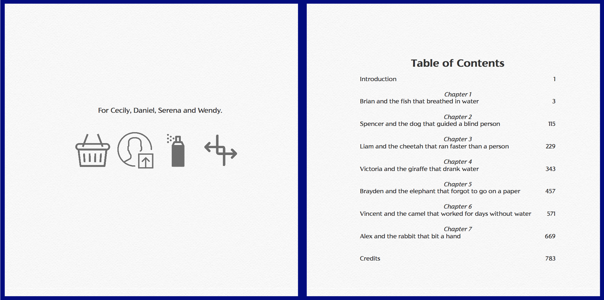
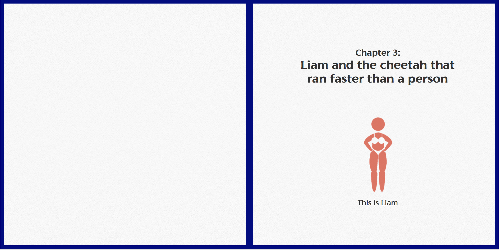
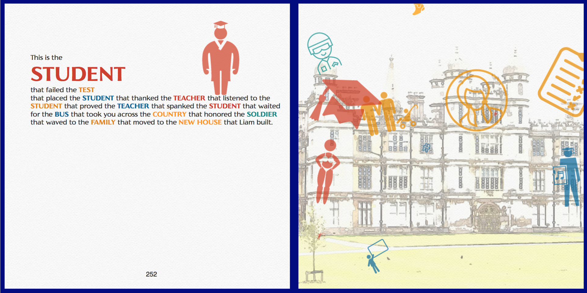
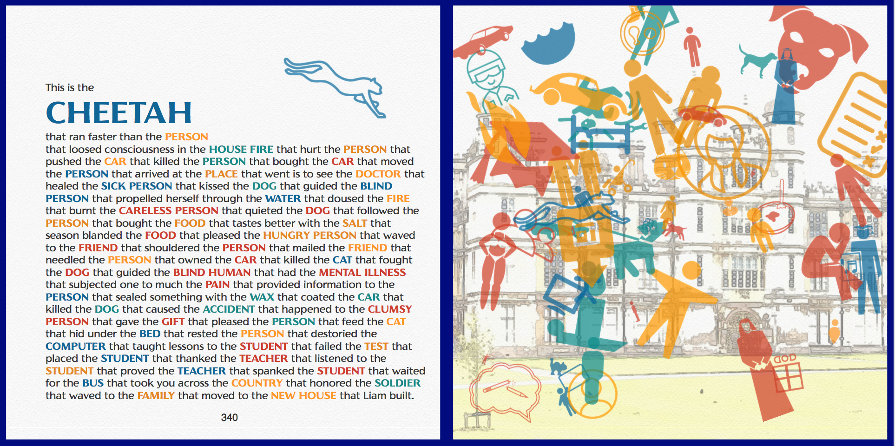
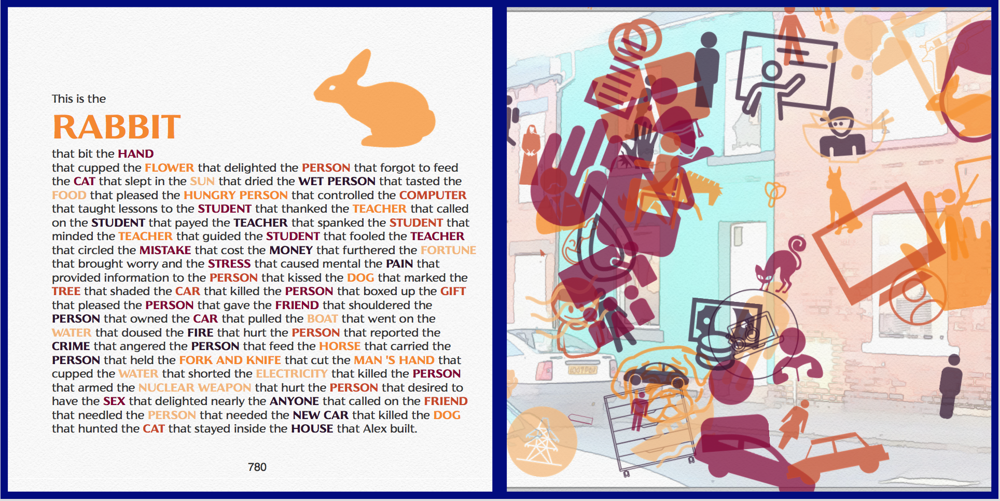
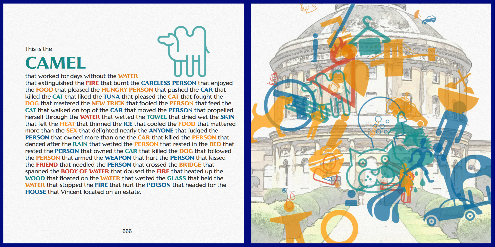

# The House(s) that ConceptNet Built

This project is a children's book generated by walking through related nouns and verbs in [ConceptNet](http://conceptnet.io), with illustrations from [The Noun Project](http://thenounproject.com). The structure is based on the classic nursery rhyme, "[The House that Jack built](https://en.wikipedia.org/wiki/This_Is_the_House_That_Jack_Built)," with quite a few permutations.

The core idea is relatively simple, even though it took me a few weeks of trial and error to implement it: the code builds chains of concepts of whatever length that end in "house". Once I figured out how to generate those chains, I found that 7 chains of 55 concepts each (chapters) would get me over 50,000 words, so then I had to figure out how to illustrate it. 

## Running it Yourself

If for some reason you want to run this yourself, you'll need quite a few Python modules:
I think most are pretty standard, but a few that are not may be `requests`, `textblob`, `pattern.en`, `glob`, `flickrapi`, `weasyprint`, and `pycorpora`.

You'll also need a file called "credentials" formatted like this:

```
flickr_key = {yours goes here}
flickr_secret = {yours goes here}
noun_key = {yours goes here}
noun_secret = {yours goes here}
```

And you'll need these directories for all of the page and pdf generation: 

 - `pages/`
 - `icons/`
 - `images/`
 - `pdfs/`

Finally, this uses Fred Weinhaus's ["watercolor"](http://www.fmwconcepts.com/imagemagick/watercolor/index.php) script for ImageMagick to make the illustrations. Put this in the same directory as the Python script.

## Samples 

The [Smaller Sample](https://github.com/zachwhalen/nngm17/blob/master/output-smaller-sample.pdf) is 7 chapters with 5 concepts each. It's about 15mb after optimizing it in Adobe Acrobat. 

The Complete Version, titled [<cite>The several houses of Brian, Spencer, Liam, Victoria, Brayden, Vincent, and Alex</cite>](https://github.com/zachwhalen/nngm17/blob/master/output-optimized.pdf) is 7 chapters with 55 concepts each. It's 800 pages long, but only 23mb after optimization. I generated this on Saturday, December 16 2017, and it took about 1 hour to complete. The main text comes to 49,799, but that doesn't count the chapter titles, front matter, or end credits, so I'm sure it's over 50K all together.

## Screenshots

Here are some screenshots. 








